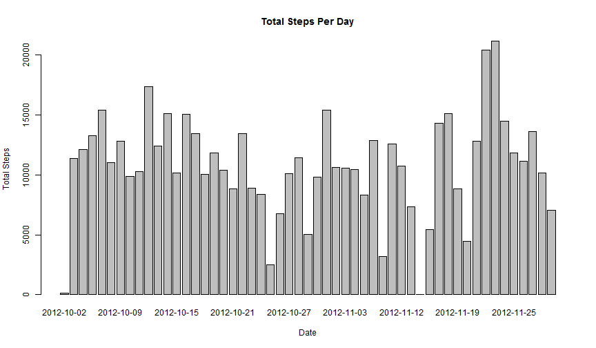
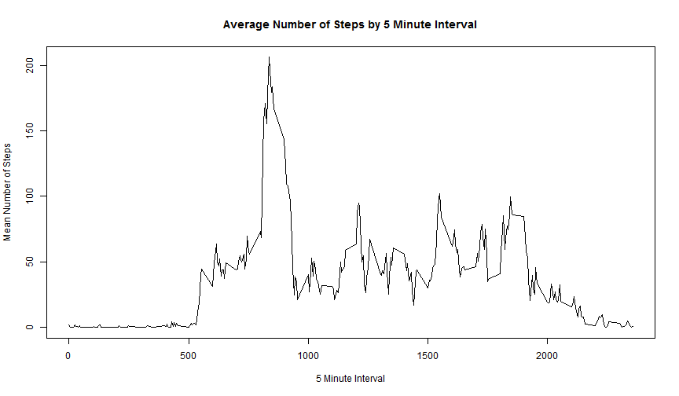
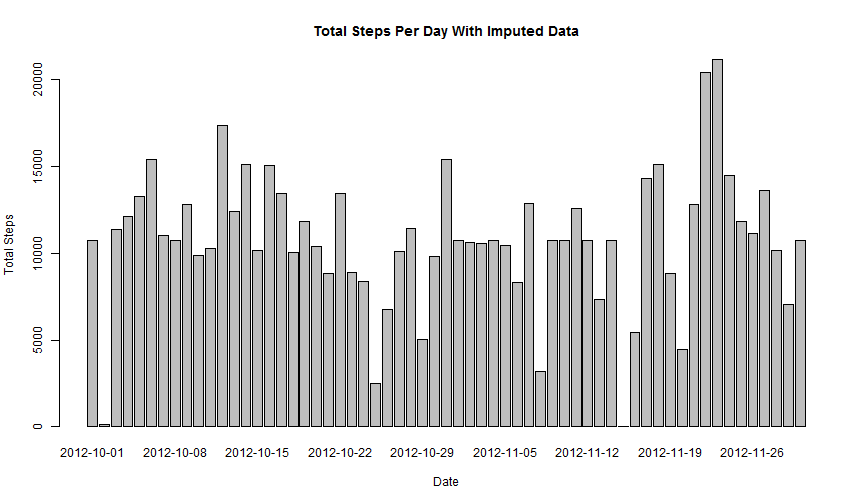
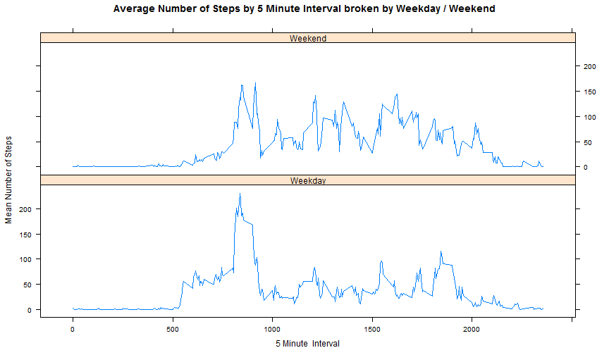

Reproducible Research: Peer Assessment 1
========================================
## Global Options
A little housekeeping before we get started. Per the instructions, make sure we have echo=TRUE set even though it is the default, so it is set here as a global option.

```r
opts_chunk$set(echo=TRUE)
```

## Loading and preprocessing the data
The following code will set the working directory for my machine, you can comment this line, or set it as appropriate for your system. The rest of the code will presume you are already in the proper directory. 

```r
setwd("~/Coursera/Data Scientist/5 - Reproducible Research/Peer_Assign_1")
```
The data for this project was provided in a zipped dataset *'activity.zip'*. When it is unzipped there is a file called activity.csv we can read into R. So, let's go ahead and unzip the file and get it into an R object.

```r
unzip("activity.zip")
dfRawData <-read.csv("activity.csv")
```
The R object now contains the CSV data file.  The values for *steps* and *interval* have both come in as *int* but the date has come in as a factor.  The following will convert it to a Date object.

```r
dfRawData$date<-as.Date(dfRawData$date,format="%Y-%m-%d")
```

The data is now loaded into R and we can proceed to answer the questions.  But first, let's cleanup that CSV file that was unzipped.  The *unlink* function will delete it.

```r
unlink("activity.csv")
```

## What is mean total number of steps taken per day?
This is a two fold question. First, there will be a plot of the total number of steps by day, then there will be a calculation of the mean and median number of steps per day.
### Plot the total number of steps for the day.
Days with no values reported (*NA*) are being skipped for this analysis.

```r
dfTotalSteps<-aggregate(steps~date,dfRawData,sum,na.action=na.omit)
barplot(dfTotalSteps$steps,names.arg=dfTotalSteps$date, 
        xlab="Date", 
        ylab="Total Steps", 
        main="Total Steps Per Day")
```

 
### Calculate the Mean and Median number of steps per day.
I can use the total number of steps calculated above to get the mean and median.  NA's have already been omitted from the data frame.

```r
medianSteps<-median(dfTotalSteps$steps)
meanSteps  <-mean(dfTotalSteps$steps)
```
The median number of steps taken per day is 10765 while the mean number of steps taken each day is 10766

## What is the average daily activity pattern?
Similar to above, I am going to aggregate the number of steps, except this time I will aggregate by the interval rather than the date and use the mean function rather than the sum.

```r
dfMeanStepsByInterval<-aggregate(steps~interval,data=dfRawData, FUN="mean",na.action=na.omit)
plot(dfMeanStepsByInterval$interval,
     dfMeanStepsByInterval$steps,
     type="l",
     xlab="5 Minute Interval",
     ylab="Mean Number of Steps",
     main="Average Number of Steps by 5 Minute Interval")
```

 
Using the data from the plot we can determine which interval had the most steps. Once we have that, we can use that as an index to locate the interval.

```r
maxSteps   <-max(dfMeanStepsByInterval$steps)
maxInterval<-dfMeanStepsByInterval[dfMeanStepsByInterval$steps==maxSteps,1]
```
The maximum average number of steps was 206.1698 which occurred at 5 minute interval number 835.


## Imputing missing values
### Calculate and report the total number of missing values in the dataset (i.e. the total number of rows with NAs) 
To get the number of *NAs* in the orignal dataset we can use the *complete.cases* function to determine how many rows have a missing value.  If we sum the results from that, we will have how many are complete then simply subtract that number from the original number of rows.

```r
vCompCases<-complete.cases(dfRawData)
numNAs    <-nrow(dfRawData)-sum(vCompCases)
```
The number of *NAs* in the dataset is 2304.

### Devise a strategy for filling in all of the missing values in the dataset. The strategy does not need to be sophisticated. For example, you could use the mean/median for that day, or the mean for that 5-minute interval, etc.
It seems that it would be better to take the average number of steps per that five minute interval to populate the missing data. If I were to use the average for the day, it may skew the results by weighting the days rather than by the interval, so I will use the the average for the interval.  To do that, I will use the Mean by Interval dataset calculated earlier along with the True / False vector I created with the *complete.cases* results I calculated for the *NA* count.  Logically, the Date and the Interval should not be NA, which I confirmed, so only the steps are *NA*. Copy the raw data to a new object where I can fill in the steps from the Mean object if needed.

```r
dfCompleteData<-dfRawData
for (n in 1:nrow(dfCompleteData))
{
    if (!vCompCases[n])
        dfCompleteData$steps[n]<-dfMeanStepsByInterval$steps[dfMeanStepsByInterval$interval==dfCompleteData[n,"interval"]]
}
```
Now we have a complete dataset.  Make the same plot as was done with the *NAs* omitted to see if there is any difference observed.  Also, calculate the *Mean* and *Median* as was done above and show the difference, along with an explanation.

```r
dfTotalStepsComplete<-aggregate(steps~date,dfCompleteData,sum,na.action=na.omit)
barplot(dfTotalStepsComplete$steps,
        names.arg=dfTotalStepsComplete$date, 
        xlab="Date", 
        ylab="Total Steps",
        main="Total Steps Per Day With Imputed Data")
```

 

```r
medianStepsComplete<-median(dfTotalStepsComplete$steps)
meanStepsComplete  <-mean(dfTotalStepsComplete$steps)
medianDiff         <- medianSteps - medianStepsComplete
meanDiff           <- meanSteps - meanStepsComplete
```
The median number of steps taken per day using imputed data is 10766 while the mean number of steps taken each day is 10766.
This is a change of -1.189 in the median and a change of 0 for the mean.
Since the missing data was populated with the mean for the time interval, it makes sense that the overall mean would not change. Previously, missing data was ignored but since it is now populated with the mean, the mean would not change.  
The median on the other hand would move more toward the mean as the missing data is populated with the mean which has the effect of balancing the vector of data.


## Are there differences in activity patterns between weekdays and weekends?
### Create a new factor variable in the dataset with two levels - "weekday" and "weekend" indicating whether a given date is a weekday or weekend day.
Using the dataset with the imputed values for this plot. (per the instructions). Since the date field was converted to a Date datatype when we read the data in, we can use the *weekdays()* function straight away and append a column to the data frame with a *Weekend* or *Weekday* indicator.

```r
dfCompleteData$weekpart<-ifelse(weekdays(dfCompleteData$date) %in% c("Saturday","Sunday"),"Weekend","Weekday")
```
### Make a panel plot containing a time series plot (i.e. type = "l") of the 5-minute interval (x-axis) and the average number of steps taken, averaged across all weekday days or weekend days (y-axis). 
Similar to the plot above, just add the Weekend / Weekday dimension to the aggregation. Then use the lattice plotting system to make the 2 panels.
First, load the lattice library

```r
require(lattice)
```

```
## Loading required package: lattice
```
Now, let's go ahead and calculae the aggregate and plot it.

```r
dfMeanStepsByIntervalWeek<-aggregate(steps~interval+weekpart,data=dfCompleteData, FUN="mean",na.action=na.omit)
xyplot(steps ~ interval | weekpart,
       data=dfMeanStepsByIntervalWeek,
       type="l", 
       layout=c(1,2),
       xlab="5 Minute  Interval",
       ylab="Mean Number of Steps",
       main="Average Number of Steps by 5 Minute Interval broken by Weekday / Weekend")
```

 


